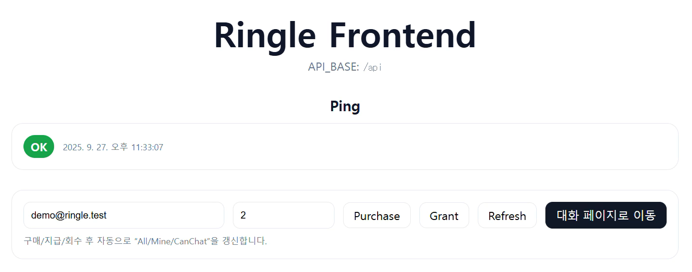
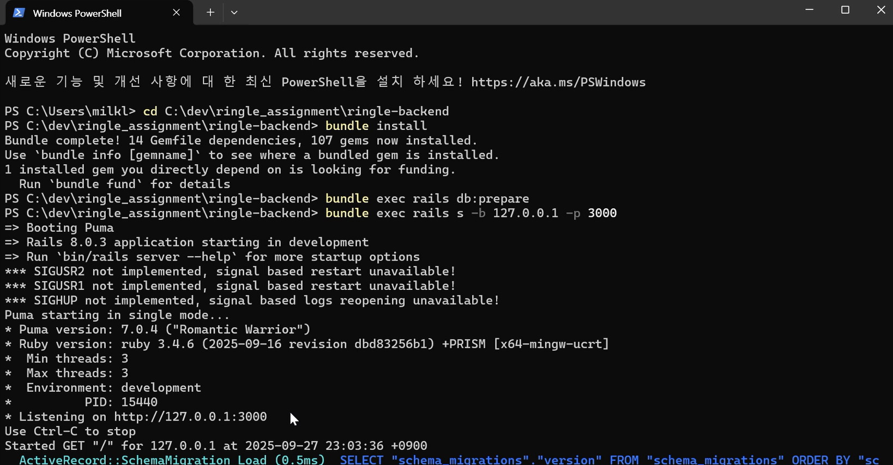
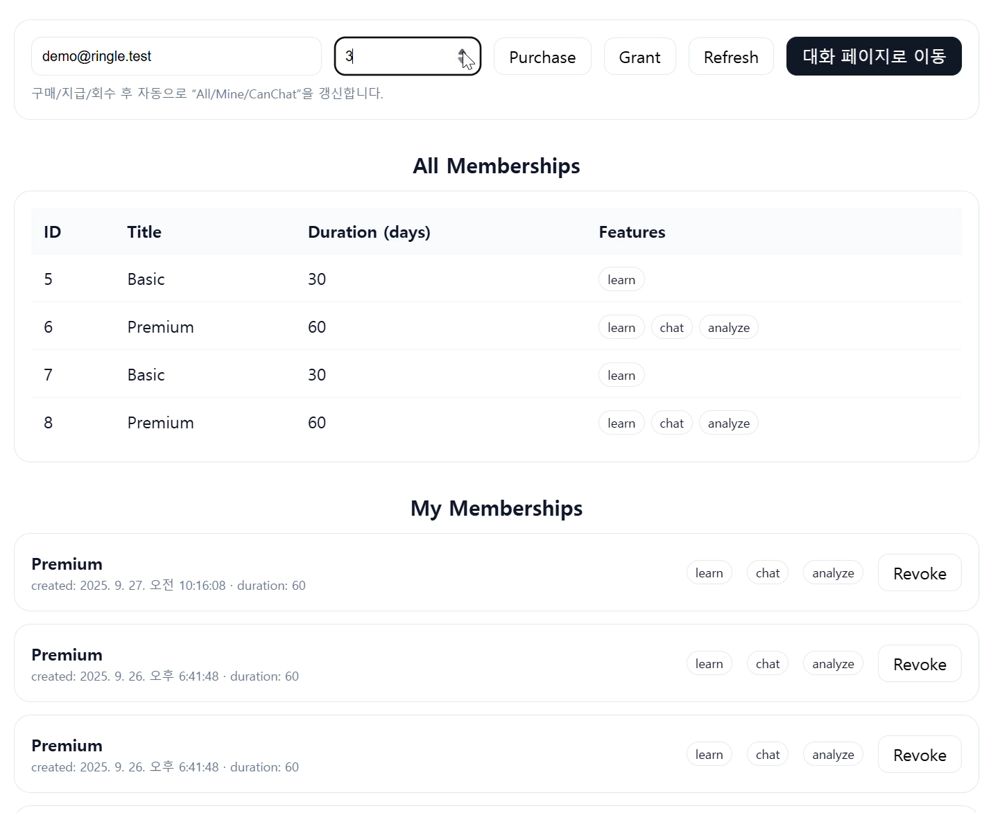
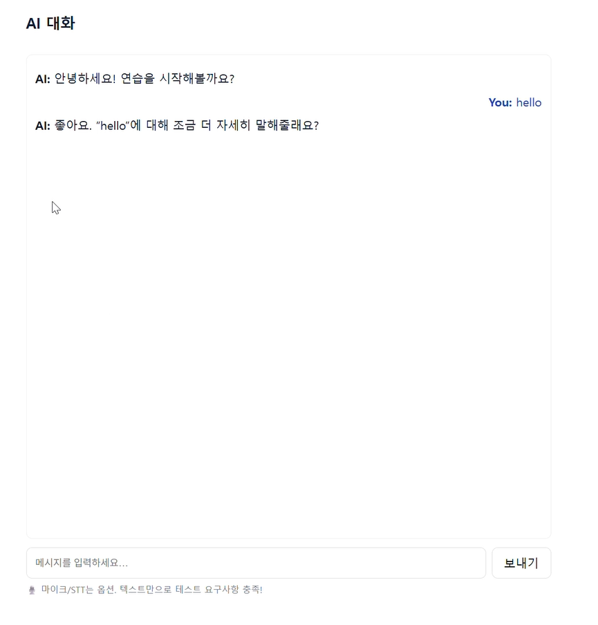
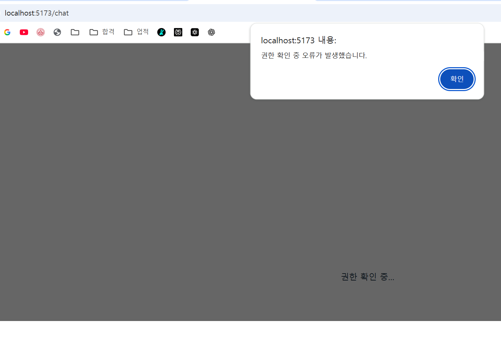
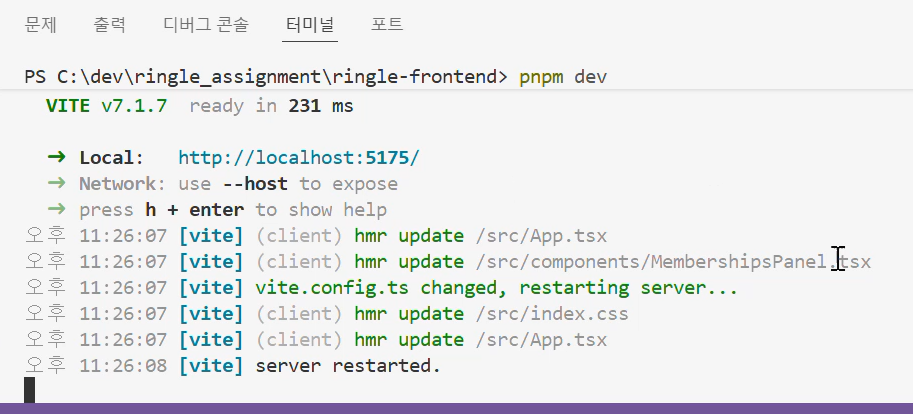

## 실행 방법

### backend
cd ringle-backend
bundle install
rails db:setup   # 시드 포함 (Basic 30d, Premium 60d)
rails s

### frontend
cd ringle-frontend
pnpm install
pnpm dev  # VITE_API_BASE=/api

### 주요 API

GET /api/v1/me/can_chat?email=... → 활성 여부 반환

GET /api/v1/memberships → 전체 멤버십 조회

GET /api/v1/users/memberships?email=... → 특정 유저 멤버십 조회

POST /api/v1/users/grant → 멤버십 지급

POST /api/v1/users/purchase → 멤버십 구매

DELETE /api/v1/users/revoke → 멤버십 회수

### 검증 시나리오 (스크린샷 첨부)

## 1. Ping 확인

## 2. Backend 실행

## 3. 멤버십 조회 & 구매/지급/회수

## 4. Notes 생성/조회

## 5. AI 대화

## 6. 권한 오류 (만료 후 차단)

## 7. Frontend 실행

