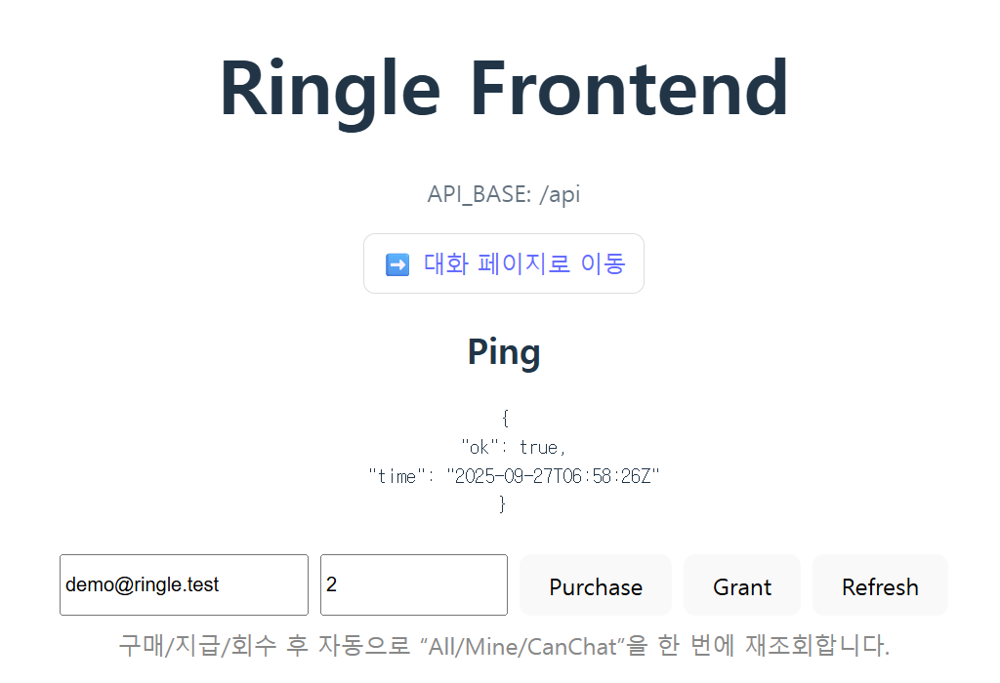
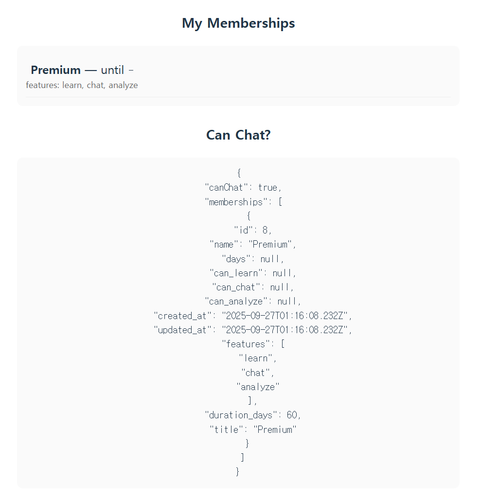
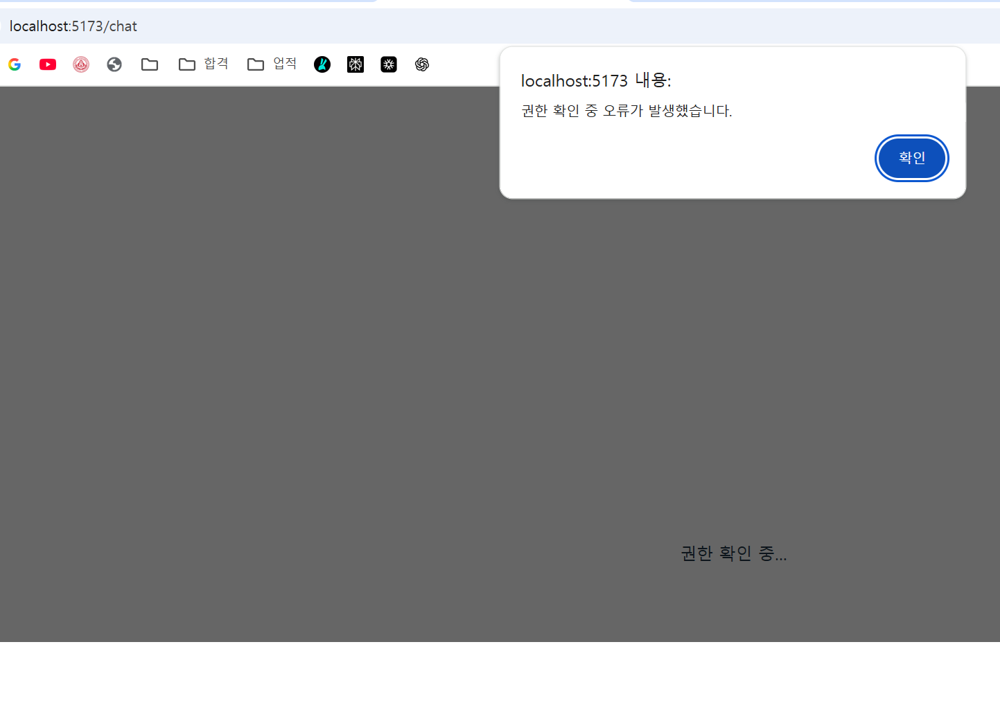
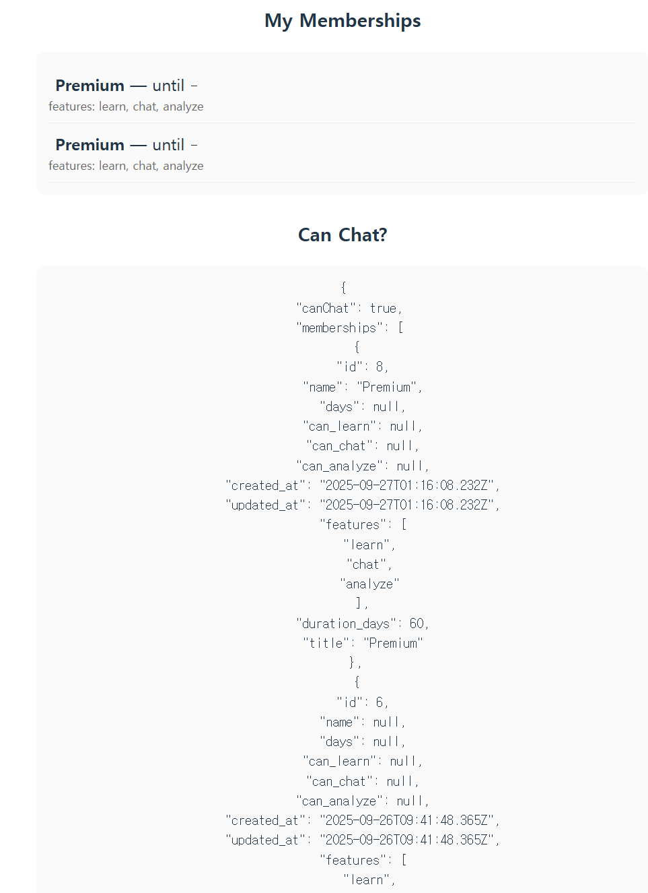
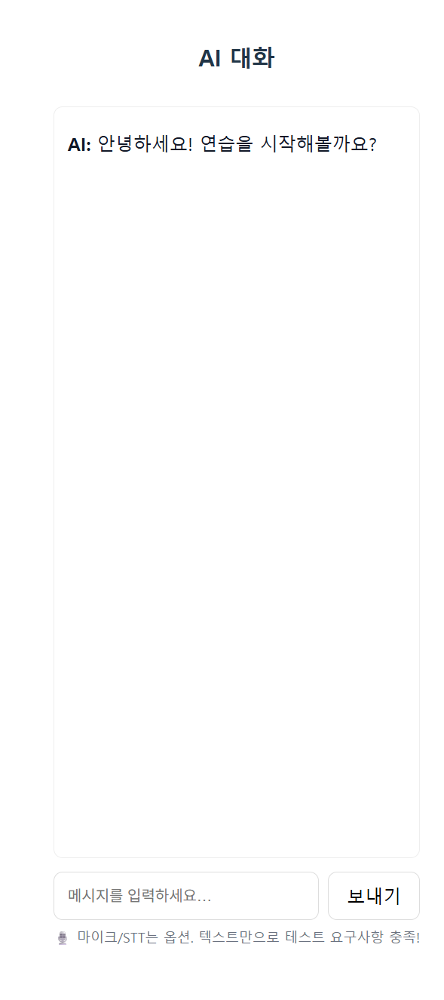
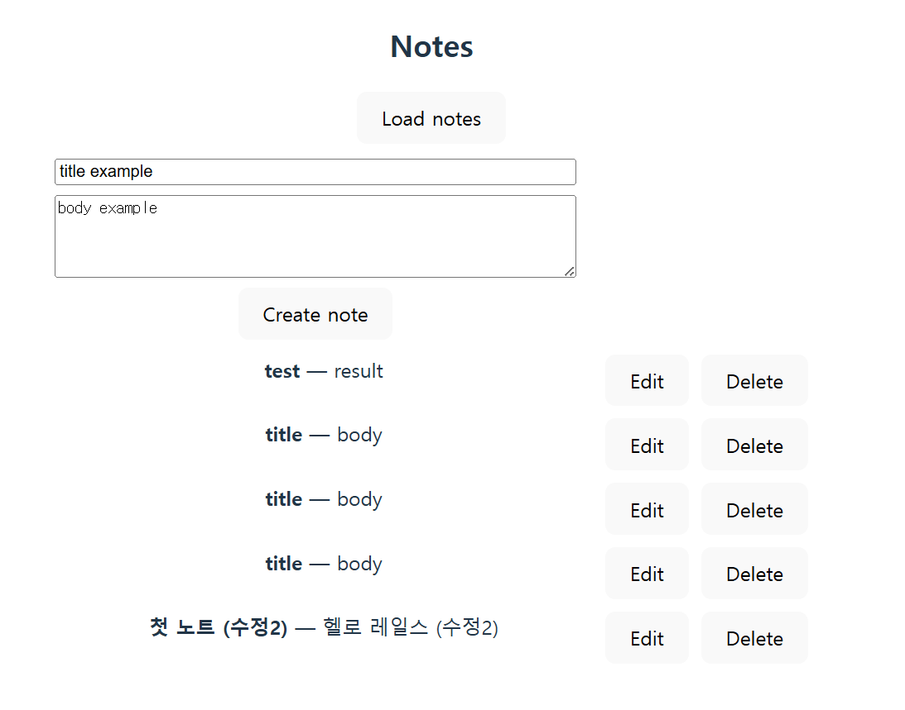

## 실행 방법


```md

### backend
```bash
cd ringle-backend
bundle install
rails db:setup   # 시드 포함 (Basic 30d, Premium 60d)
rails s

### frontend
cd ringle-frontend
pnpm install
pnpm dev  # VITE_API_BASE=/api


### 주요 API

GET /api/v1/me/can_chat?email=... → 활성 여부 반환

GET /api/v1/memberships → 전체 멤버십 조회

GET /api/v1/users/memberships?email=... → 특정 유저 멤버십 조회

POST /api/v1/users/grant → 멤버십 지급

POST /api/v1/users/purchase → 멤버십 구매

DELETE /api/v1/users/revoke → 멤버십 회수


### 검증 시나리오 (스크린샷 첨부)

만료 후 홈 → My Memberships 없음 + Can Chat=false





Grant 후 → Premium 활성 + Can Chat=true




추가 기능: Notes CRUD 확인




추가 기능: Notes CRUD 확인  


